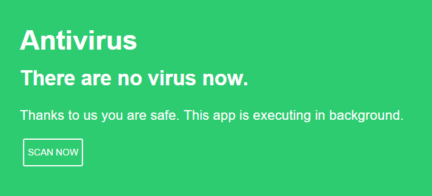

# Fake Antivirus

Fake antivirus I created to fool my uncle.
He said to me "There are a virus can you remove it ?".
I was boring of that.
I installed this software on his computer and there are no problems since.

## Installation

1. [Download for Windows](https://raw.githubusercontent.com/cedced19/fake-antivirus/master/dist/Windows.zip)
2. Extract
3. Execute `Antivirus.exe`



## To compile

```
npm install
gulp
```